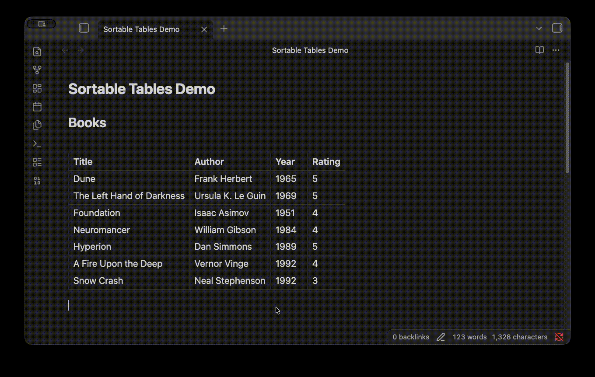
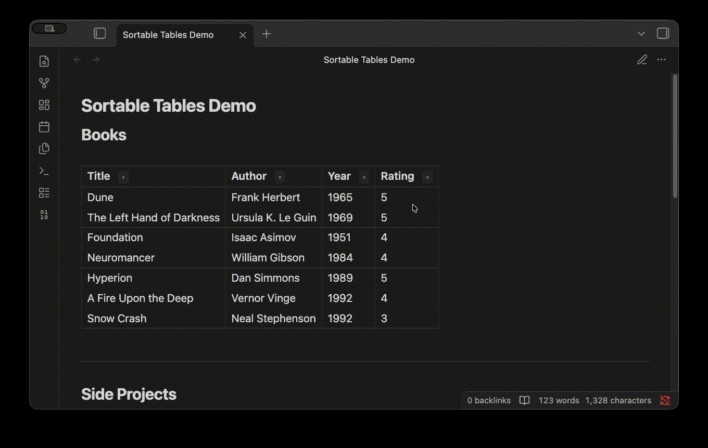

# Caretsort

A minimalist table sort for Obsidian. Named for the ▾ caret you click and a quiet nod to quicksort.



## Why I made this

Obsidian is one of those amazing tools which allow you to customize it to your liking. I like using tables in my vault for things like project lists, job trackers, reading lists, etc. I wanted a simple "one-click" solution that sorts the tables alphabetically/ascending/descending. After looking around, I came across plugins like Dataview and Advanced Tables, but no click-to-sort like I wanted. 

This is my "painkiller solution." There are no API calls or external services or config files etc. One button, one dropdown, and done.

## What it does

Adds a little `▾` next to every column header. Click the arrow, pick **A → Z** or **Z → A**, and the plugin rewrites your markdown file in place. For numerical values, it shows *Ascending* or *Descending*. The new sort order reflects in the markdown file because it's actually edited on the disk, not just in a view. You can also undo in the view mode to quickly reset the table edits.



## Installation

**Manual (for now):**

1. Grab `main.js`, `manifest.json`, and `styles.css` from the [latest release](https://github.com/Simratt/obsidian-caretsort/releases).
2. Drop them into `<your-vault>/.obsidian/plugins/caretsort/`.
3. In Obsidian: Settings → Community plugins → enable **Caretsort**.

Works in both reading view and live preview (as long as your cursor isn't inside the table you're sorting).

## What it handles

- Wiki-links with aliases like `[[file|display name]]` — the internal pipe doesn't break column splitting (regex swaps them out before parsing, swaps them back after).
- Numeric columns sort numerically.
- Text columns sort alphabetically, ignoring link syntax so you sort by what you see, not the URL.

## What it doesn't do (yet)

- Sort while your cursor is inside the table in live preview (would need a CodeMirror extension, much bigger lift).
- Multi-column sort.
- Remember last sort per table.

If I end up wanting any of these I'll add them. PRs welcome if you beat me to it.

## Development

Clone the repo, install dependencies, and either watch for changes or build once.

```bash
npm install
npm run dev      # watch mode — rebuilds on file save
npm run build    # one-off production build
```

Output lands in `main.js`. Copy `main.js`, `manifest.json`, and `styles.css` into `<your-vault>/.obsidian/plugins/caretsort/` and reload Obsidian (Cmd/Ctrl+R) to test.

## Credits

Built in a single session with [Claude Code](https://claude.com/claude-code). The idea, the regex implementation, and the scope decisions were mine — Claude wrote the scaffolding and the TypeScript faster than I could have alone.

---

Made by [Simrat Bains](https://github.com/Simratt) · MIT
